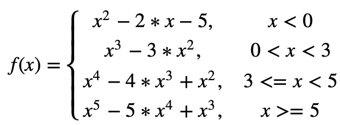

### PrograUDD Ayudantía 02

**Instrucciones**: Resuelva con un compañero/a la siguiente lista de ejercicios. Recuerde discutir la estrategia para resolver cada problema, y luego escribir el código solución. Suba su solución como un archivo `ay02_apellido1apellido2.py` a Canvas, Sección Tareas > Ayudantías. **Guarde una copia de su solución en Google Drive.** 

**1. Nota Final**. Escriba un programa que calcule la `nota_final` y el `estado_academico` (`aprobado` o `reprobado`) de un alumno en el curso de programación. Para calcular la `nota_final` del alumno utilice la siguiente expresión:

`nota_final`= `p_examen` * 70% + `examen` * 30% 

, donde `p_examen` corresponde a la nota de presentación a examen y `examen` a la nota de examen.

La nota `p_examen` se calcula siguiendo el siguiente esquema de evaluación:

|  Evaluación |%  |
|---|---|
| Ayudantías | 35% |
| Tareas | 35%|
| Certamen 1| 15%|
| Certamen 2| 15%|

Para determinar el `estado_academico` considere que un estudiante aprueba el curso cuando `nota_final >= 4.0 `. Considere además que si la nota `examen` < 3.0, el estudiante reprueba el curso.

**2. Edad.** Escriba un programa calcule la edad exacta (en años y meses) de una persona obteniendo la fecha de nacimiento a través del teclado.  

**3. Funciones.** Escriba un programa que permita obtener los valores de la siguiente funcion f(x):

 **4. Morse.** El código Morse es un sistema de codificación que se emplea para representar letras y números
mediante un conjunto de señales que se emiten de forma intermitente, y que obedecen a una configuración de puntos (para señales cortas) y rayas (para señales largas).

En la tabla adjunta podemos ver cómo se traducen a morse cada los dígitos de 0 a 9:

| No| Representación Morse  |No |Representación Morse |
|---|----                   |--- |---- |
| 0 | - - - - -             |5 | . . . . .  |
| 1 | . - - - -             |6 | - . . . .  | 
| 2 | . . - -               |7 | - - . .   |
| 3 | . . . -               |8 | - - - .  |
| 4 | . . . . -             |9 | - - - - .   |

Escriba un programa que reciba un número entero entre 0 y 9 y entregue su representación en Morse.

**5. Alquiler.** Una compañía dedicada al alquiler de automóviles cobra un monto fijo de \$30.000 para los primeros 300 km recorridos. Para más de 300 km y hasta 1000 km, cobra un monto adicional de \$1.500 por cada kilómetro extra, mientras que para más de 1000 km se cobra un monto adicional de \$1.000 por cada kilómetro extra.  

Escriba un programa que permita determinar el monto a pagar por el alquiler de un vehículo, dado su recorrido. Incluya en el precio final el 19% de impuesto a pagar por concepto de IVA.

**6. IMC.** El índice de masa corporal (IMC), es un indicador que relaciona la masa y la altura y permite determinar el estado nutricional de una persona. El IMC se calcula utilizando la siguiente fórmula:

$$
IMC=\frac{peso}{altura^{2}}
$$

Escriba un programa que calcule IMC de una persona y determine su estado nutricional dado su peso y altura. 

|  Valor IMC|E. Nutricional  |
|---|---|
| < 20 | BAJO PESO |
| 20 - 24,9 | NORMAL|
| 25 - 27,5 | SOBREPESO|
| 27,6 - 29,9 | OBESIDAD LEVE (TIPO I)|
| 30 - 39,9 | OBESIDAD MODERADA (TIPO II)|
| >=40 | OBESIDAD SEVERA (TIPO III)|

**7. Venta.** Un vinicultor vende uva de los tipos A y B y de tamaño 1 y 2. El precio de la uva es controlado por la asociación de vinicultores (ASVI) cuya politica fija un precio inicial para el kilo de uva que se incrementa o disminuye segun el tipo de uva y el tamaño siguiendo las siguientes reglas:

- Si la uva es del tipo A, al precio inicial establecido por la ASVI se le agregan \$20 por kilo para la uva de tamaño 1 y \$30  por kilo para la uva de tamaño 2. 
- Si la uva es del tipo B, al precio inicial establecido por la ASVI se le rebajan \$30 por kilo para la uva de tamaño 1 y \$50 por kilo para la uva de tamaño 2. 

Realice un programa para determinar la ganancia obtenida por el vinicultor considerando que usted es el presidente de la ASVI y el que controla el precio inicial de la uva.