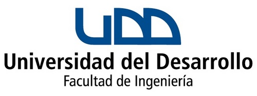

<div align="center">

</div>

<h4 align="center">Taller de Programación</h4>
<h4 align="center">Certamen 2</h4>
<h5 align="center">19 de Noviembre de 2019</h5>

**Instrucciones:**

- Lea atentamente el enunciado de cada uno de los problemas.
- Elija solo **DOS** de los TRES problemas del certamen.
- Para cada problema cree un archivo.py distinto. El nombre del archivo debe ser el número del problema (uno.py, dos.py o tres.py)
- Comprima los problemas en un solo archivo **ZIP** y subalo a la sección Evaluación en [http://canvas.udd.cl](http://canvas.udd.cl). Solo tiene una oportunidad para subir sus respuestas.
- Recuerde que usaremos un software de detección de plagio para detectar copia.

<div style="page-break-after: always;"></div>

**(3pts) Problema 1. Cuenta Vocales** 

Programe la función `vocales(texto)` que recibe un texto, y que retorne un diccionario con las siguientes características:

1. las llaves (`keys`) del diccionario deben corresponder a las palabras del texto y estas deben aparecer una sóla vez en el diccionario
2. los valores `(values)` del diccionario deben corresponder al número de vocales que contiene la palabra llave `key`.

Por **ejemplo**, si su función recibe el texto:

```python
ningun canon borrara el surco de tu arrozal el derecho de vivir en paz 
```

, el diccionario que debe retornar es: 

```python
{'ningun': 2, 'canon': 2, 'borrara': 3, 'el': 1, 'surco': 2, 'de': 1, 'tu': 1,
 'arrozal': 3, 'derecho': 3, 'vivir': 2, 'en': 1, 'paz': 1}
```

Use el código del cuadro para verificar su función.

```python
def vocales(texto):
	d = {}
	#escriba aquí su función
	return d

mensaje = 'ningun canon borrara el surco de tu arrozal el derecho de vivir en paz'
conteo = vocales(mensaje)
print(conteo)
```
**Nota:** asuma que el texto que se ingresará no contiene números ni signos de puntuación, y que todo el texto será ingresado en minúsculas.

<div style="page-break-after: always;"></div>

**(3pts) Problema 2. Cámara de Diputados**

Dada la contingencia nacional, usted decide realizar un estudio sobre el desempeño de los diputados y su gastos operacionales.  Para esto, usted cuenta con información obtenida de la web, almacenada en el archivo `data_diputados.txt`. Este archivo contiene 5 datos: el `id` del diputado, su `nombre`, `partido_político`, `gasto_operacional`, y  el `total_asistencias`, respectivamente.  Escriba un programa que responda la pregunta de investigación: **¿cuál es el diputado con el mayor gasto operacional de la cámara, y a qué partido pertenece?**. 

<div style="page-break-after: always;"></div>

**(3pts) Problema 3. Similitud**

Una de las principales tareas en el campo de la Inteligencia Artificial es reconocer en que medida dos elementos (imágenes, texto, música, etc...) son similares. Esto sirve para programar algoritmos sencillos que permiten a plataformas como Spotify o Youtube recomendarte canciones o videos, basándose en su similitud.

Una de las medidas más utilizadas para calcular que tan parecidos son dos elementos es la **Similitud de Kowalski**. Esta medida representa un elemento como un vector, donde cada dimensión corresponde a una característica de los elementos a comparar. Por ejemplo, para el caso canciones las caracteristicas de los vectores pueden ser los bpm, el estilo musical, etc.

La **Similitud de Kowalski** para los vectores X e Y  de $n$-dimensiones en $\mathbb{R}^n$ está definida como: 

$$kowalski(X,Y) = \frac{ X \cdot Y}{\sqrt{ X \cdot X} \sqrt{ Y \cdot Y } }$$

, donde $X \cdot X$ es el **producto punto** $X \cdot Y$ es el producto punto entre los vectores $X$ e $Y$.

Por **ejemplo**, si $X = [1, 0, 1]$, e $Y = [0, 1, 1]$ en $\mathbb{R}^3$, la **Similitud Kowalski** corresponde a $0.5$, ya que:

  * $ X \cdot Y = [1, 0, 1] \cdot [0, 1, 1] = 1$
  * $ \sqrt{X \cdot X} = [1, 0, 1] \cdot [1, 0, 1] = \sqrt 2$
  * $ \sqrt{Y \cdot Y} = [0, 1, 1] \cdot [0, 1, 1] = \sqrt 2$

, y luego $\frac{1}{\sqrt 2 \sqrt 2} = 1 /2 = 0.5$.

Implemente la función `kowalski(x,y)` que retorna la Similitud de Kowalski, asumiendo que los vectores a comparar son listas. Use el código del cuadro para probar su función.

```python
from math import sqrt

def kowalski(x, y):
    ## escriba aqui su función
    return 
    
x = [1, 0, 1]
y = [0, 1, 1]
sim = kowalski(x, y)
print('similaridad:', sim) 
```
**Nota:** recuerde que el producto punto entre dos vectores A y B está definido como $A \cdot B = \sum_{i=1}^n A_i B_i$.
